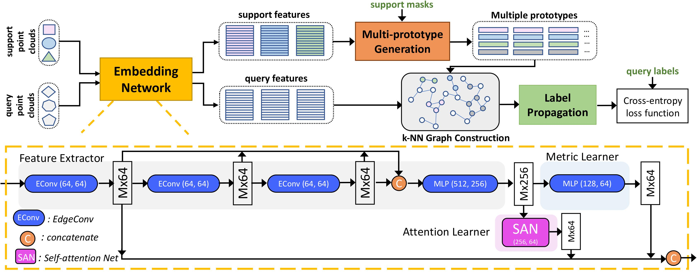

# Few-shot 3D Point Cloud Semantic Segmentation
Created by <a href="https://github.com/Na-Z" target="_blank">Na Zhao</a> from 
<a href="http://www.nus.edu.sg/" target="_blank">National University of Singapore</a>



## Introduction
This repository contains the PyTorch implementation for our CVPR 2021 Paper 
"[Few-shot 3D Point Cloud Semantic Segmentation](https://arxiv.org/pdf/2006.12052.pdf)" by Na Zhao, Tat-Seng Chua, Gim Hee Lee.

Many existing approaches for point cloud semantic segmentation are fully supervised. These fully supervised approaches 
heavily rely on a large amount of labeled training data that is difficult to obtain and can not generalize to unseen 
classes after training. To mitigate these limitations, we propose a novel attention-aware multi-prototype transductive 
few-shot point cloud semantic segmentation method to segment new classes given a few labeled examples. Specifically, 
each class is represented by multiple prototypes to model the complex data distribution of 3D point clouds. 
Subsequently, we employ a transductive label propagation method to exploit the affinities between labeled 
multi-prototypes and unlabeled query points, and among the unlabeled query points. Furthermore, we design an 
attention-aware multi-level feature learning network to learn the discriminative features that capture the semantic 
correlations and geometric dependencies between points. Our proposed method shows significant and consistent 
improvements compared to the baselines in different few-shot point cloud segmentation settings (i.e. 2/3-way 1/5-shot) 
on two benchmark datasets.


## Installation
- Install `python` --This repo is tested with `python 3.6.8`.
- Install `pytorch` with CUDA -- This repo is tested with `torch 1.4.0`, `CUDA 10.1`. 
It may work with newer versions, but that is not gauranteed.
- Install `faiss` with cpu version
- Install 'torch-cluster' with the corrreponding torch and cuda version
	```
	pip install torch-cluster==latest+cu101 -f https://pytorch-geometric.com/whl/torch-1.5.0.html
	```
- Install dependencies
    ```
    pip install tensorboard h5py transforms3d
    ```

## Usage
### Data preparation
#### S3DIS
1. Download [S3DIS Dataset Version 1.2](http://buildingparser.stanford.edu/dataset.html).
2. Re-organize raw data into `npy` files by running
   ```
   cd ./preprocess
   python collect_s3dis_data.py --data_path $path_to_S3DIS_raw_data
   ```
   The generated numpy files are stored in `./datasets/S3DIS/scenes/data` by default.
3. To split rooms into blocks, run 

    ```python ./preprocess/room2blocks.py --data_path ./datasets/S3DIS/scenes/```
    
    One folder named `blocks_bs1_s1` will be generated under `./datasets/S3DIS/` by default. 


#### ScanNet
1. Download [ScanNet V2](http://www.scan-net.org/).
2. Re-organize raw data into `npy` files by running
	```
	cd ./preprocess
	python collect_scannet_data.py --data_path $path_to_ScanNet_raw_data
	```
   The generated numpy files are stored in `./datasets/ScanNet/scenes/data` by default.
3. To split rooms into blocks, run 

    ```python ./preprocess/room2blocks.py --data_path ./datasets/ScanNet/scenes/ --dataset scannet```
    
    One folder named `blocks_bs1_s1` will be generated under `./datasets/ScanNet/` by default. 


### Running 
#### Training
First, pretrain the segmentor which includes feature extractor module on the available training set:
    
    cd scripts
    bash pretrain_segmentor.sh

Second, train our method:
	
	bash train_attMPTI.sh


#### Evaluation
    
    bash eval_attMPTI.sh

Note that the above scripts are used for 2-way 1-shot on S3DIS (S^0). You can modified the corresponding hyperparameters to conduct experiments on other settings. 


## Citation
Please cite our paper if it is helpful to your research:

    @inproceedings{zhao2021few,
      title={Few-shot 3D Point Cloud Semantic Segmentation},
      author={Zhao, Na and Chua, Tat-Seng and Lee, Gim Hee},
      booktitle={Proceedings of the IEEE/CVF Conference on Computer Vision and Pattern Recognition},
      year={2021}
    }


## Acknowledgement
We thank [DGCNN (pytorch)](https://github.com/WangYueFt/dgcnn/tree/master/pytorch) for sharing their source code.
